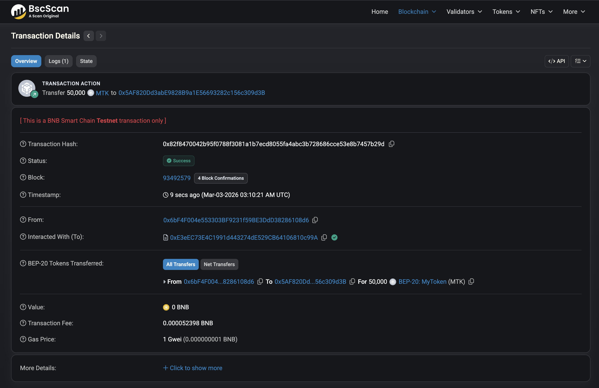
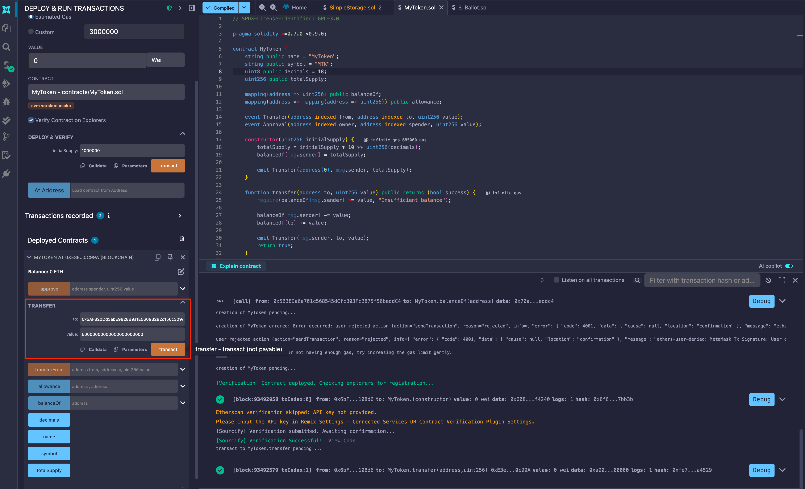
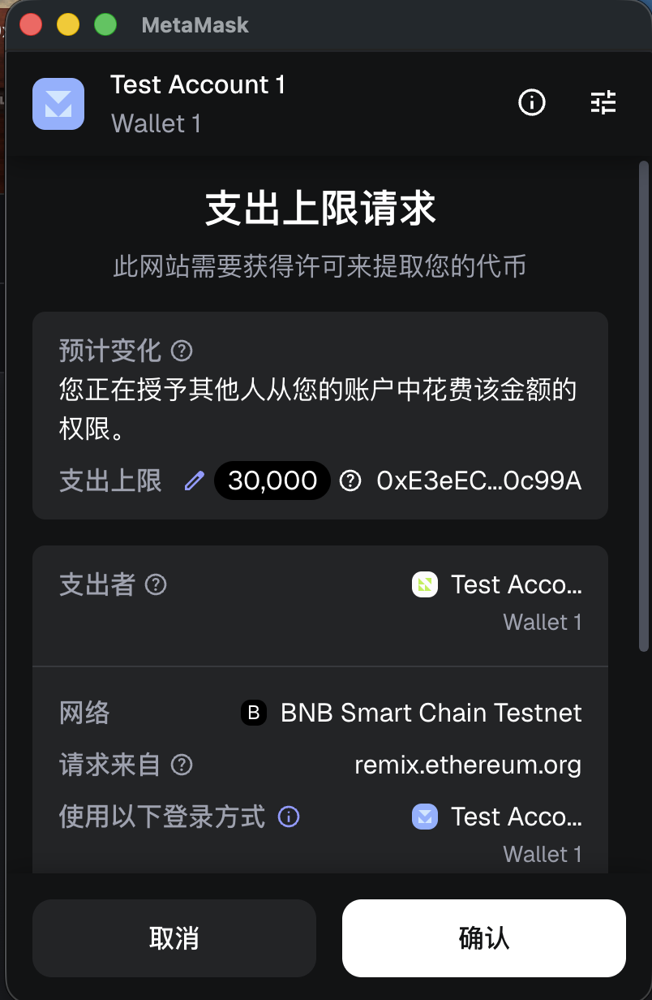
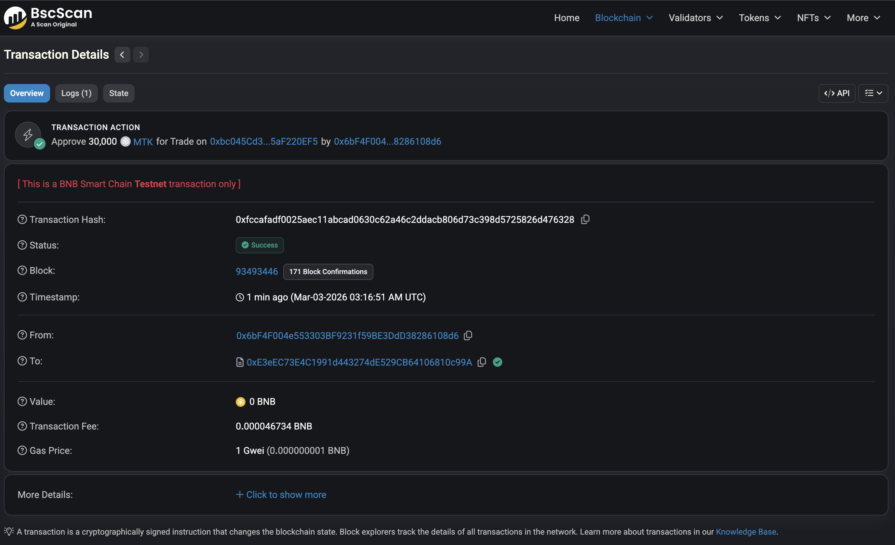
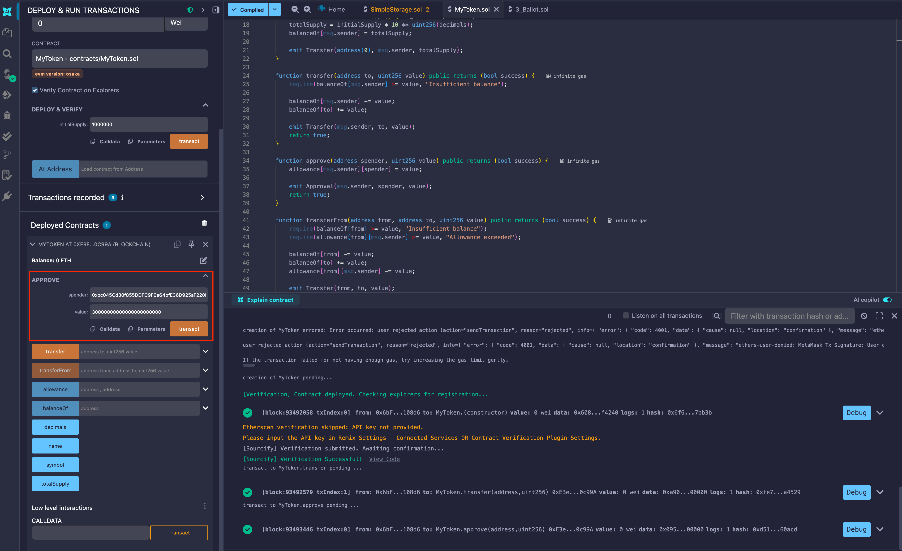
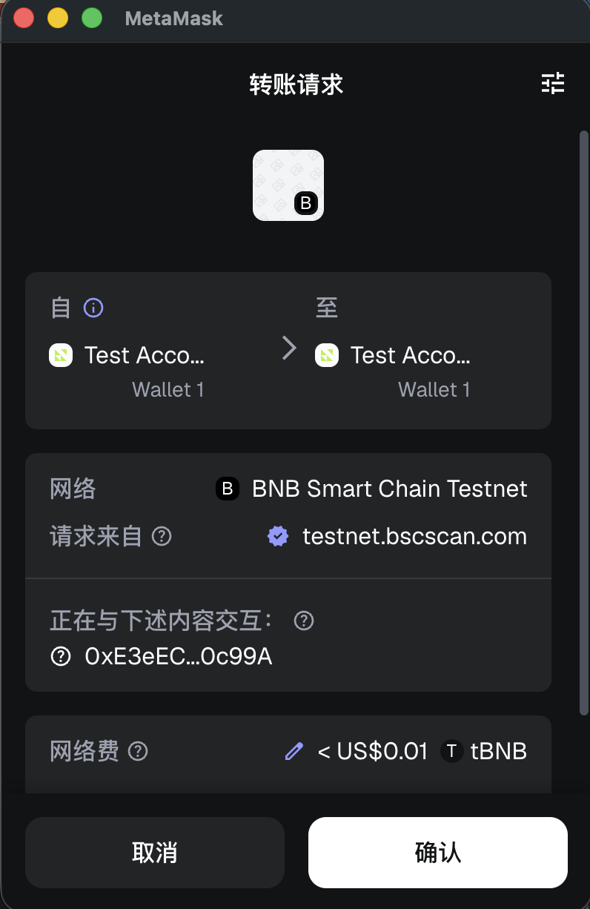
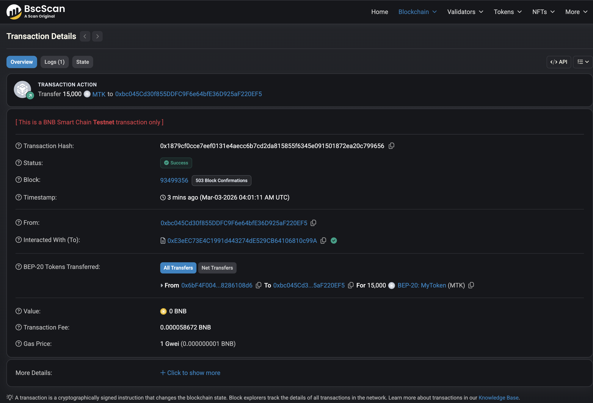

# MyToken

## 合约的部署地址

`0xE3eEC73E4C1991d443274dE529CB64106810c99A`

## 部署合约的交易哈希

`0x5abff51a10da8422c65c049877d2467211bc73803e65b74c7d1fb06e53b301e4`

## 合约交互操作截图

### 直接转账

`0x6bF4F004e553303BF9231f59BE3DdD38286108d6` 向 `0x5AF820Dd3abE9828B9a1E56693282c156c309d3B` 转账 `50000000000000000000000`。

### 授权

`0x6bF4F004e553303BF9231f59BE3DdD38286108d6` 授权 `30000000000000000000000` 额度给 `0xbc045Cd30f855DDFC9F6e64bfE36D925aF220EF5`。

### 转账（授权后）

`0x6bF4F004e553303BF9231f59BE3DdD38286108d6` 授权 `0xbc045Cd30f855DDFC9F6e64bfE36D925aF220EF5` 转账给 `0xbc045Cd30f855DDFC9F6e64bfE36D925aF220EF5`。
